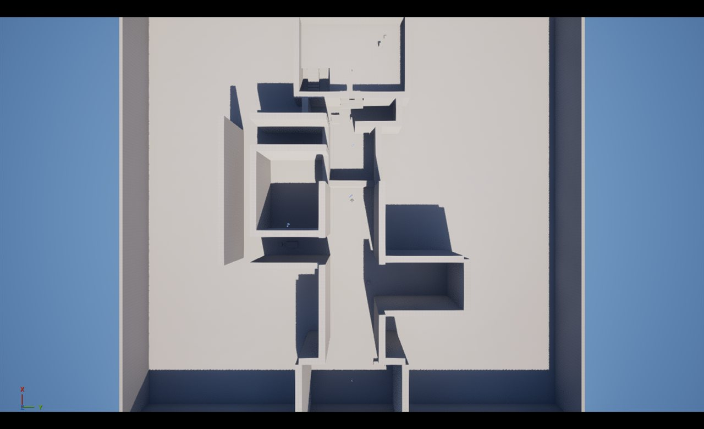
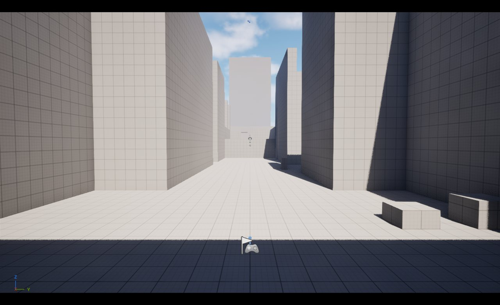
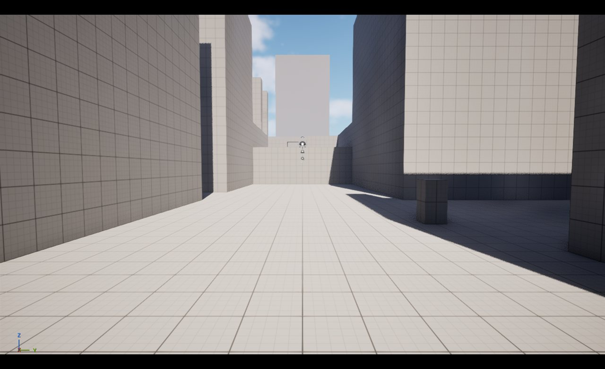
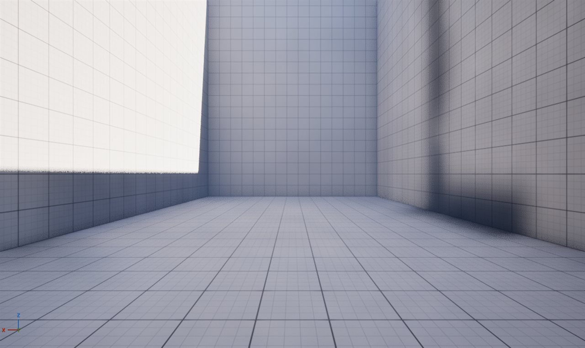
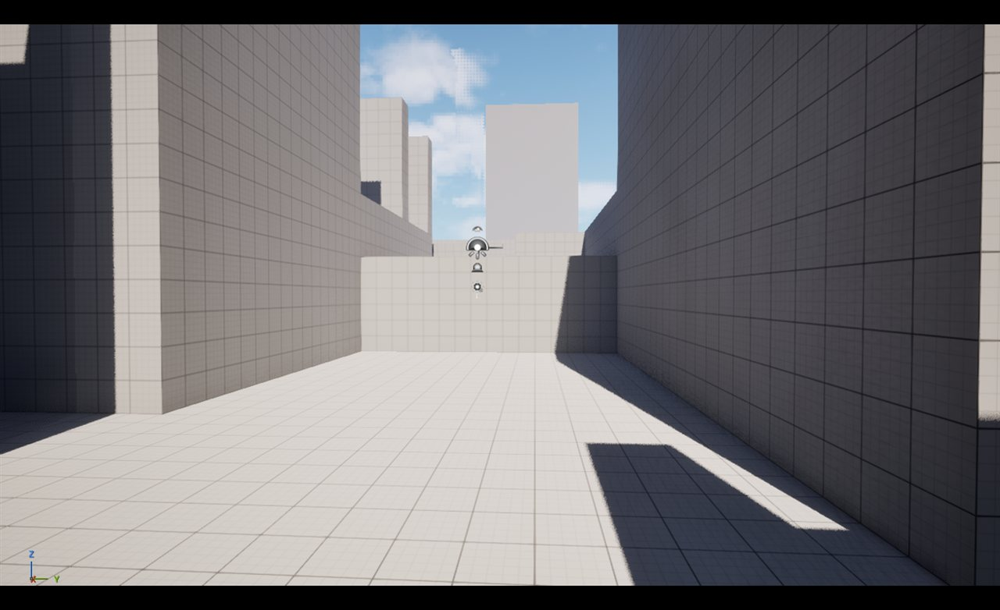
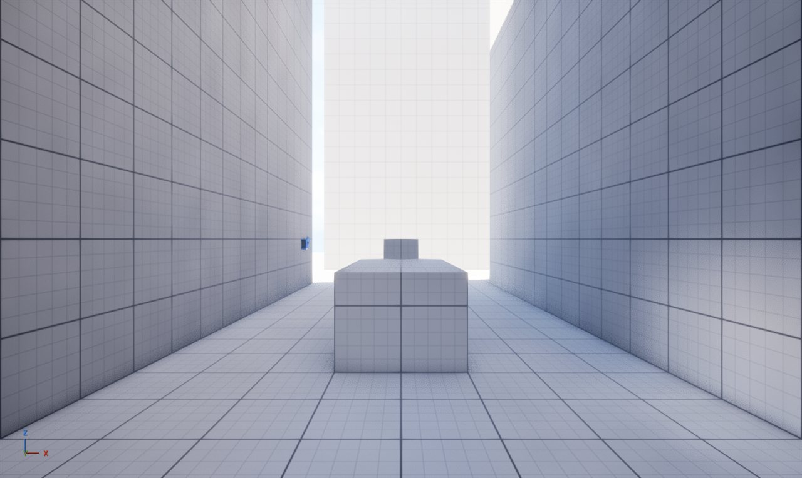
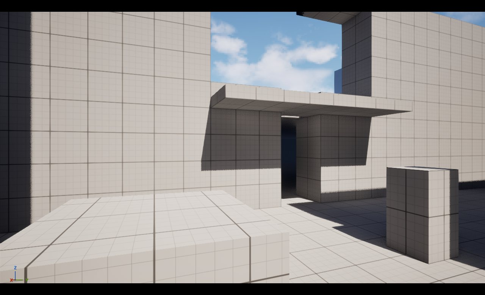
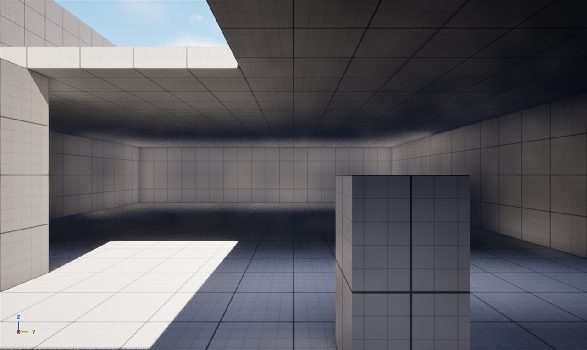
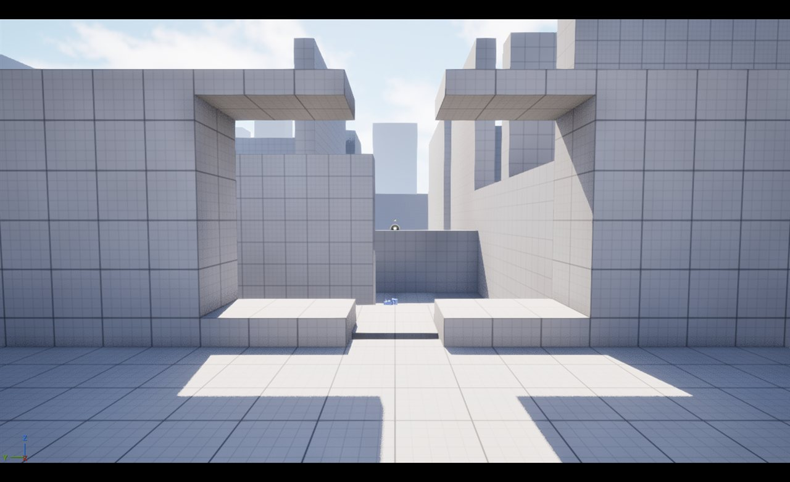

# 블록아웃 구역별 스크린샷 — Phase 1 검토

`Lvl_NeonDistrict` 블록아웃을 구역별로 촬영해 동선 설계(`level_flow.md`)가 실제 공간에서
성립하는지 검토한 기록이다. 1차 촬영에서 두 가지 문제를 발견해 수정했고, 이 문서의 이미지는
**수정 후** 상태다.

에디터 뷰포트 캡처, 1280×764. 라이팅은 템플릿 기본값이며 아직 손대지 않았다.
화면에 떠 있는 아이콘은 라이트와 카메라 액터의 에디터 스프라이트다.

---

## 1차 촬영에서 발견한 문제와 수정

### 문제 1 — 2층에 창이 없어 "원경 재개방" 비트가 성립하지 않았다

서쪽 벽이 통짜라 200cm 출입구 틈으로만 밖이 보였고, 그마저 광장 벽에 막혀 있었다.
`CAM_Perf_03`을 그 자리에 둔 이유(실내에서 원경을 보는 최악의 렌더링 조합)도 성립하지 않았다.

- 서쪽 벽을 6조각으로 분할해 **폭 8m · 높이 4.5m(z 500~950) 창 개구부**를 만들었다
- 건물 외벽을 8m → 10m로 올렸다. 창 헤드가 낮으면 8m 뒤에서 하늘이 3.6°밖에 열리지 않아
  앙각 13.2°의 원경이 프레임에 들어오지 않는다. 10m로 올려 상방 시야가 17.9°로 확보됐다

### 문제 2 — 어느 시점에서도 원경이 보이지 않았다

원인은 두 가지였다.

**근경 장애물이 너무 높았다.** 경계 파사드 30m, 셔터 25m, 광장 벽 20m가 지상 시점의 하늘을 덮었다.
각각 15m / 6m / 10m로 낮췄다.

**원경 블록이 시야축 밖에 있었다.** 폭 16m 대로는 시야를 ±8°로 제한하는데, 가장 가까운 Ring 1 블록이
13.9° 밖에 있어 파사드에 가려졌다. `DIST_R1_00`을 대로 축(`+X`)으로, `DIST_R1_06`을 2층 창 축(`-X`)으로
옮기고 각각 170m / 160m로 키웠다. 블록 개수는 20개 그대로다.

---

## 전체 배치

150m × 150m 플레이 구역. 화면 아래쪽이 `+X`(적 건물 방향), 오른쪽이 `+Y`다.

## A 진입부 — `(-7400, 0, 450)` 정면

파사드가 대로 쪽으로 좁아지는 깔때기 구조. **대로 끝에 원경 랜드마크가 프레이밍된다.**
비트 1 "스케일 압도, 원경 완전 개방"이 성립한다. 가운데 파란 물체는 `CAM_Perf_01` 카메라 액터다.

## B 대로 — `(-4400, 0, 250)` 동향

폭 16m 대로. 오른쪽 벽면의 어두운 개구부가 전투 골목 입구, 그 앞 기둥이 `MRK_Fixer`다.
좌우 파사드 25m가 협곡감을 만들면서 정면의 원경을 프레이밍한다.

## C 상점 골목 — `(-2750, 900, 200)` 북향

폭 5m, 27m 길이의 막다른 골목. 원경이 완전히 차단되는 구간이다.

## 셔터 — `(-2600, 300, 350)` 동향

대로가 셔터 쪽으로 뻗는다. 셔터를 6m로 낮춰 **막혀 있지만 그 너머가 보인다** —
"저기가 목적지인데 지금은 못 간다"는 정보가 전달되고, 동시에 원경 시야축을 열어준다.

## D 전투 골목 — `(-1600, -1400, 200)` 남향

폭 8m, 벽 높이 20m. 가운데가 150cm 엄폐물, 왼쪽 벽에 붙은 기둥이 `MRK_Enemy_01`이다.
엄폐물이 통로 중앙을 막아 좌우 선택을 만들고, 정면 끝의 밝은 개구부 너머가 보이지 않으므로
조우 타이밍 통제라는 ㄷ자 설계 의도가 성립한다. 원경은 완전히 차단된다.

## E 광장 — `(2600, -600, 250)` 건물 정면

적 건물 서쪽 면. 가운데 개구부가 출입구, 그 위 얇은 판이 2층 발코니다.
**복귀 경로가 진입 시점에 미리 보인다.** 광장 벽을 10m로 낮춰 하늘이 열렸다.

## F 적 건물 1F — `(4200, -700, 200)` 동향

2층 바닥이 천장 역할을 한다. 왼쪽 위에서 들어오는 빛이 계단실 개구부다.
오른쪽 기둥이 `MRK_Enemy_04`. 실내가 어두운 것은 조명을 아직 넣지 않았기 때문이다(Phase 5).

## F 적 건물 2F 서쪽 창 — `(4500, 0, 700)` 서향

새로 만든 창 개구부 너머로 **지나온 거리와 원경 실루엣이 함께 보인다.**
비트 8 "원경 재개방"이 성립하고, `CAM_Perf_03`의 측정 의도(실내에서 원경을 보는 최악의 조합)도
이제 유효하다.

---

## 남은 것

| 항목 | 상태 |
|---|---|
| 실내 조명 | Phase 5 |
| 적 건물 지붕 | 미제작 (현재 상부 개방) |
| 네비메시 | 미빌드 |
| 계단 | **해결.** 아래 참조 |

## 기준선 측정에 미치는 영향

이번 수정으로 벽 높이와 원경 블록 두 개의 위치·크기가 바뀌었다.
`docs/perf/baseline.md`의 수치는 수정 이전 상태에서 측정된 것이므로,
Phase 3 재측정 시 이 변경을 반영해 다시 잡는다. 원경 블록 개수는 20개로 동일하다.

---

## 계단 보행 검증 (PIE)

1차 블록아웃의 계단은 4단 × 단높이 100cm였다. PIE에서 캐릭터 이동 설정을 직접 읽어보니
**올라갈 수 없는 구조였다.**

| 값 | 측정 | 의미 |
|---|---:|---|
| `MaxStepHeight` | 45cm | 걸어서 올라갈 수 있는 최대 단높이 |
| `WalkableFloorAngle` | 44.77° | 걸을 수 있는 최대 경사 |
| `JumpZVelocity` | 420 | 점프 도달 높이 약 90cm |
| `CapsuleHalfHeight` | 96cm | |

단높이 100cm는 `MaxStepHeight` 45를 넘고 점프 높이 90cm도 넘는다.
걸어서도 뛰어서도 올라갈 수 없었다.

**10단 × 단높이 40cm / 디딤 100cm**로 재구성했다(런 10m, 경사 21.8°).
40 ≤ 45이므로 보행으로 오를 수 있고, 최상단(z 400)에서 2층 바닥(z 440)으로 오르는
마지막 단차도 40cm다.

PIE에서 실제로 확인했다.

| 테스트 | 결과 |
|---|---|
| 계단 3번 칸(top 120) 위에 배치 | z 218에 안착 (기대 216), `MOVE_Walking`, 속도 0 |
| 2층 바닥(top 440) 위에 배치 | z 538에 안착 (기대 536), `MOVE_Walking`, 속도 0 |

낙하하지 않고 `MOVE_Walking` 상태로 정지하므로 계단과 2층 바닥의 콜리전이 정상이고,
단높이가 보행 한계 안에 있다.

**앞으로 블록아웃에 단차를 만들 때는 40cm를 기준으로 한다.** 45cm가 한계이므로
여유를 두지 않으면 바닥 오차나 경사에서 걸린다.
